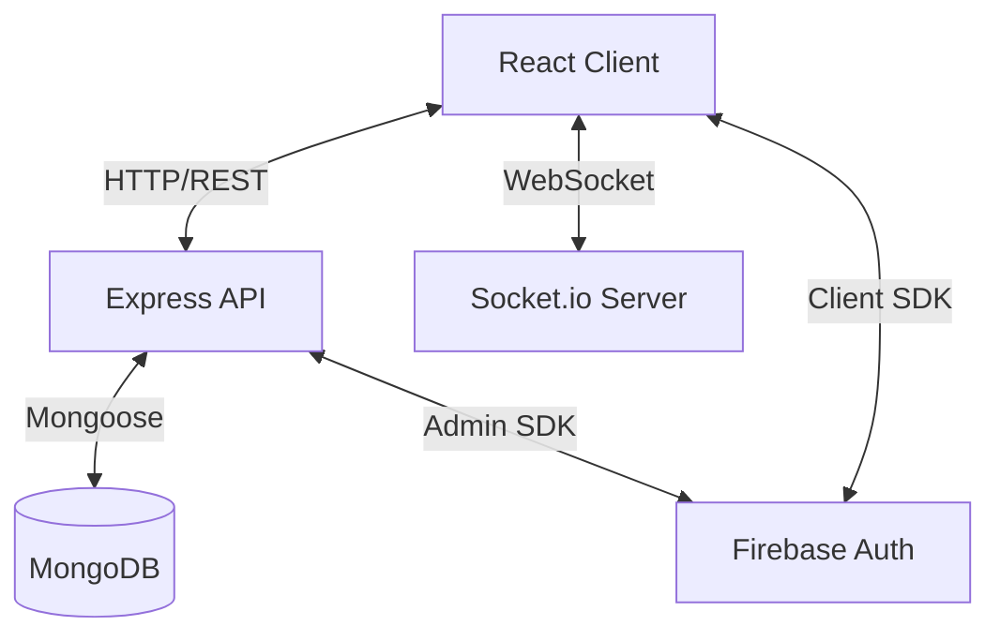

# Codebase Analysis: Trade-Talkies (MERN to Next.js)

## 1. Current Architecture

The existing application is a standard MERN stack (MongoDB, Express, React, Node.js) separated into two distinct parts:
- **Frontend**: React (Vite) + Tailwind CSS + TanStack Router + Zustand.
- **Backend**: Node.js + Express + Socket.io + Mongoose.

### Architecture Diagram (Current)

## 2. Frontend Structure
- **Framework**: React 18/19 with Vite.
- **Routing**: `@tanstack/react-router` (File-based routing in `src/routes`).
- **State Management**: `Zustand` (stores) + `TanStack Query` (server state).
- **UI Library**: `shadcn/ui` (Radix UI + Tailwind).
- **Key Features**:
  - Authentication (Sign In/Up)
  - Onboarding (Profile creation)
  - Chat Interface (Rooms, Messages)
  - Real-time updates via Socket.io hooks.

## 3. Backend Logic
- **Server**: Express.js with `http` server for Socket.io attachment.
- **Database**: MongoDB with Mongoose ODM.
- **Authentication**: Firebase Admin SDK verifies Bearer tokens.
- **Real-time**: Socket.io events (`join_channel`, `send_message`, `receive_message`).

### API Endpoints
| Method | Endpoint | Description | Next.js Equivalent |
|--------|----------|-------------|--------------------|
| POST | `/api/users/onboarding` | Create/Update user profile | `POST /api/users/onboarding` |
| GET | `/api/users/:uid` | Get user profile | `GET /api/users/[uid]` |
| GET | `/api/rooms` | List public rooms | `GET /api/rooms` |
| GET | `/api/rooms/joined` | List joined rooms | `GET /api/rooms/joined` |
| GET | `/api/rooms/recommended` | List recommended rooms | `GET /api/rooms/recommended` |
| POST | `/api/rooms` | Create a room | `POST /api/rooms` |
| POST | `/api/rooms/:roomId/join` | Join a room | `POST /api/rooms/[roomId]/join` |
| GET | `/api/messages/:channelId` | Get chat history | `GET /api/messages/[channelId]` |
| POST | `/api/messages` | Send message (HTTP fallback) | `POST /api/messages` |

## 4. Database Schema (Mongoose -> Prisma)

### User
- `uid` (String, unique) - Firebase UID
- `email` (String, unique)
- `username` (String)
- `displayName` (String)
- `photoURL` (String)
- `interests` (String[])
- `joinedRooms` (ObjectId[] -> Room)

### Room
- `name` (String)
- `description` (String)
- `owner` (String -> User UID)
- `tags` (String[])
- `members` (String[] -> User UIDs)
- `channels` (Subdocument: name, type)

### Message
- `channelId` (ObjectId -> Room.channels._id)
- `sender` (Object: uid, username, photoURL)
- `content` (String)
- `type` (text/image)
- `timestamp` (Date)

## 5. Authentication Flow
1. **Client**: User logs in via Firebase Client SDK (Google/Email).
2. **Client**: Gets ID Token.
3. **Client**: Sends ID Token in `Authorization` header to Backend.
4. **Backend**: Middleware verifies token using `admin.auth().verifyIdToken()`.
5. **Backend**: Attaches `req.user` and proceeds.

## 6. Migration Strategy
- **Monolith**: Combine Frontend and Backend into Next.js.
- **Socket.io**: Since Vercel Serverless functions don't support persistent WebSockets, we will use a **Custom Next.js Server** (`server.ts`) to run both Next.js and Socket.io on the same port. This requires a Docker-based deployment (e.g., Railway, Fly.io, or VPS) rather than standard Vercel hosting.
- **Database**: Replace Mongoose with Prisma ORM.
- **API**: Convert Express controllers to Next.js Route Handlers.
